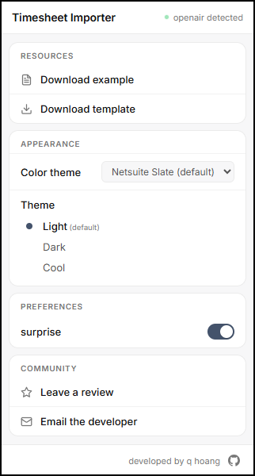
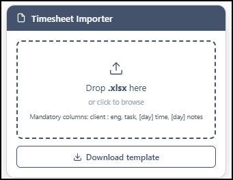
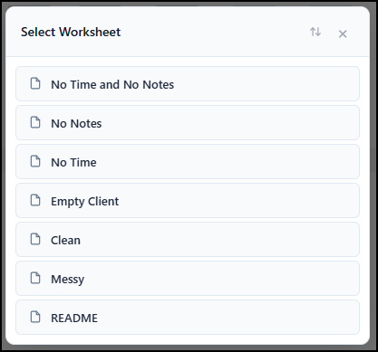
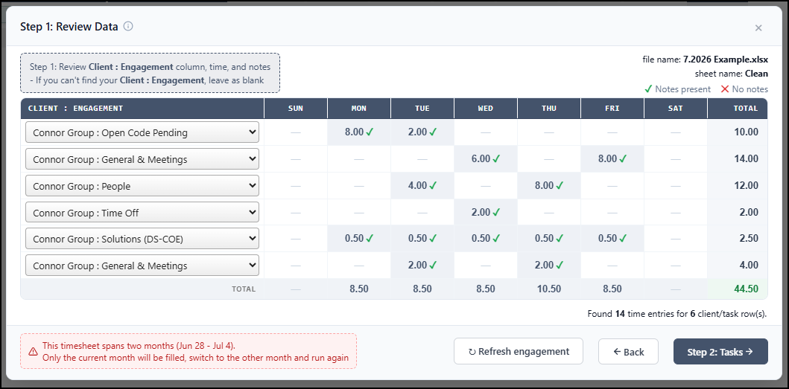
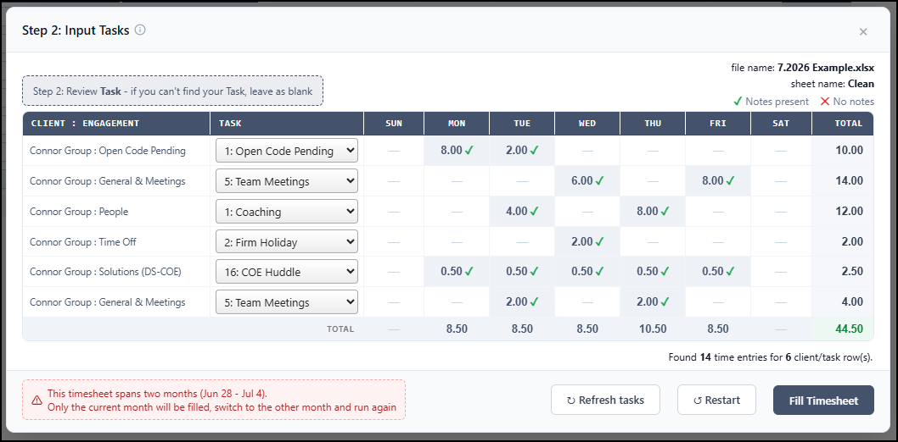
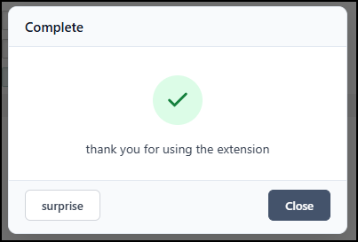

# OpenAir Timesheet Importer (Google Chrome Extension)

A Manifest V3 Chrome extension that fills your weekly **NetSuite SuiteProjects Pro (OpenAir)** timesheet from a simple Excel file — drag, review, confirm, done.

---

## The problem (and why this helps)

Every week, professionals spend **5–10 minutes — often longer —** manually keying their hours and notes into OpenAir's dated SuiteProjects Pro grid, one client, task, day, and note at a time. It's slow, repetitive, and easy to fumble.

This extension automates that. You keep your week in a plain Excel file, drop it onto the OpenAir timesheet page, review what's about to be entered, and the tool types it into the grid for you. You stay in control — **you** click Save at the end.

Everything runs locally in your browser. The extension only reads the Excel file you drop and writes into the OpenAir page you're already on. No data is sent anywhere.

---

## Download & installation

1. **Download this repo** — click the green **Code → Download ZIP** and unzip it (or `git clone` it).
2. Open **`chrome://extensions`** in Chrome.
3. Turn on **Developer mode** (toggle, top-right).
4. Click **Load unpacked** and select the unzipped project folder.
5. Open (or refresh) your OpenAir weekly timesheet page — a small **Timesheet Importer** panel appears in the bottom-right corner.

You can grab the Excel format from the extension popup (click the toolbar icon): **Download template** (blank) and **Download example** (a filled-in sample). The template is also downloadable from the bottom-right panel.

---

## How to use

Fill out your week in the template — `Client : Engagement`, `Task`, and each day's **time** and **notes** — then:

### Step 1 — Drag & drop
Drag your `.xlsx` onto the bottom-right panel (or click the panel to browse for it).

If the workbook has more than one sheet, pick the week you want to import:

### Step 2 — Review data & Client : Engagement
A modal lists every row and the days it parsed. Pick the matching **Client : Engagement** for each row from the dropdown — it auto-matches where it can, and **↻ Refresh engagement** re-pulls the list straight from the page. When it looks right, click **Step 2: Tasks**.

### Step 3 — Review tasks
The tool builds your rows in OpenAir and pulls each row's **Task** options. Confirm or change the task per row (or leave it blank), then click **Fill Timesheet**. **↻ Refresh tasks** re-reads a row's tasks from the page if needed.

### Step 4 — Done!
Your hours and notes are written into the grid. Review everything and click OpenAir's **Save**. A **Complete** confirmation appears (with an optional surprise you can turn off under **Preferences** in the popup).

Hit **surprise** for a random emote - it even tells you the odds you rolled it.

---

## Edge cases

**Timesheets that span two months.** When your week straddles a month boundary, OpenAir splits it across two monthly timesheets. The tool fills the **current** month and shows a warning banner; switch OpenAir to the other month and run the tool again for the remaining days.

**You don't have the Client : Engagement code yet.** If a row's Client : Engagement is left blank (or can't be matched):

- it defaults to **`Connor Group : Open Code Pending`**;
- if your account doesn't have that code, it falls back to **blank**.

The Task follows the same idea — a blank task uses that row's *Open Code Pending* task when available, otherwise it stays blank.

**How rows get created (the temporary-code trick).** OpenAir auto-creates a new timesheet row for you — but only *after* you commit a **valid** Client : Engagement; it will **not** spawn a row for a blank value. So when a row is meant to be blank, the tool briefly selects a valid Client : Engagement to trick OpenAir into creating the row, then resets that row's Client : Engagement back to blank.

---

## Notes

- Manifest V3, no backend, no remote code (SheetJS is vendored locally).
- Timesheet data is processed in memory only — never stored or transmitted.
- Themes and a few preferences (like hiding the surprise) live in the extension popup.
